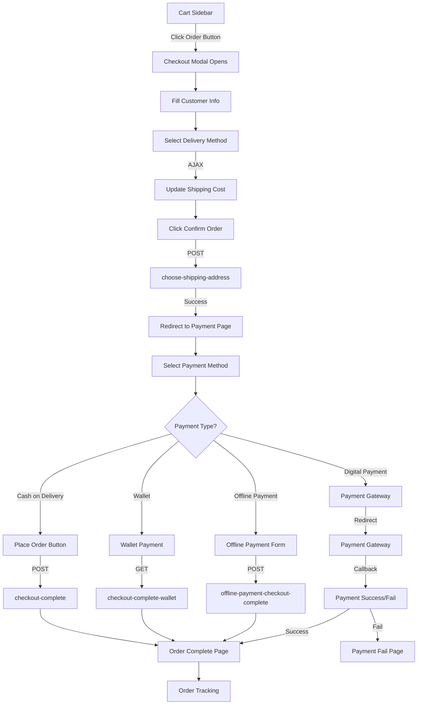

# Order Flow Documentation - Greenmarket Theme

This document describes the complete checkout and order placement flow for the Greenmarket theme.

## Table of Contents
1. [Overview](#overview)
2. [Flow Diagram](#flow-diagram)
3. [Step-by-Step Flow](#step-by-step-flow)
4. [Routes & Endpoints](#routes--endpoints)
5. [Data Payloads](#data-payloads)
6. [Controllers & Methods](#controllers--methods)
7. [Views](#views)
8. [Session Variables](#session-variables)
9. [Payment Methods](#payment-methods)
10. [Error Handling](#error-handling)

---

## Overview

The Greenmarket theme implements a **simple checkout flow** that allows customers to:
1. Add products to cart
2. Open checkout modal from cart sidebar
3. Fill shipping information
4. Select delivery method
5. Choose payment method
6. Place order
7. View order confirmation

The flow supports both **guest checkout** and **authenticated customer** checkout.

---

## Flow Diagram

### Mermaid Diagram (for GitHub/GitLab)


### ASCII Flow Diagram
```
┌─────────────────┐
│   Cart Sidebar  │
│  (Add Products) │
└────────┬────────┘
         │ Click "অর্ডার করুন"
         ▼
┌─────────────────────────┐
│   Checkout Modal Opens   │
│  (_checkout.blade.php)   │
└────────┬─────────────────┘
         │
         ├─► Fill Customer Info
         │   - Name, Phone, Email
         │   - City, Address
         │
         ├─► Select Delivery Method
         │   └─► AJAX: set-shipping-method
         │       └─► Update Shipping Cost
         │
         └─► Click "Confirm Order"
             │
             ▼
┌──────────────────────────────────┐
│  POST /customer/choose-shipping- │
│           address                 │
│  (SystemController)               │
└────────┬──────────────────────────┘
         │
         ├─► Validate Address
         ├─► Check Restrictions
         ├─► Save Address
         └─► Set Session Variables
             │
             ▼
┌─────────────────────────────┐
│   Redirect to Payment Page  │
│   GET /checkout-payment      │
│   (WebController)            │
└────────┬─────────────────────┘
         │
         ├─► Display Order Summary
         └─► Display Payment Methods
             │
             ▼
┌─────────────────────────────────┐
│   Select Payment Method          │
│   ┌───────────────────────────┐ │
│   │ • Cash on Delivery         │ │
│   │ • Digital Payment Gateways │ │
│   │ • Wallet Payment           │ │
│   │ • Offline Payment          │ │
│   └───────────────────────────┘ │
└────────┬──────────────────────────┘
         │
         ├─────────────────────────────────┬──────────────────┬──────────────────┐
         │                                 │                  │                  │
         ▼                                 ▼                  ▼                  ▼
┌──────────────────┐         ┌──────────────────┐  ┌──────────────┐  ┌──────────────┐
│ Cash on Delivery │         │ Digital Payment   │  │   Wallet     │  │   Offline    │
│                  │         │                   │  │              │  │              │
│ GET /checkout-   │         │ POST /web-       │  │ GET /checkout│  │ POST /offline│
│ complete         │         │ payment-request  │  │ -complete-   │  │ -payment-    │
│                  │         │                   │  │ wallet       │  │ checkout-    │
│ payment_method=  │         │ Redirect to      │  │              │  │ complete     │
│ cash_on_delivery │         │ Gateway          │  │ Deduct from  │  │              │
└────────┬─────────┘         └────────┬──────────┘  │ Wallet       │  │ Collect Info │
         │                            │              └──────┬───────┘  └──────┬───────┘
         │                            │                     │                 │
         │                            ▼                     │                 │
         │                   ┌─────────────────┐            │                 │
         │                   │ Payment Gateway │            │                 │
         │                   │ (Stripe/PayPal/ │            │                 │
         │                   │  Razorpay/etc)  │            │                 │
         │                   └────────┬────────┘            │                 │
         │                            │                     │                 │
         │                            ├─► Success           │                 │
         │                            └─► Fail              │                 │
         │                            │                     │                 │
         └────────────────────────────┼─────────────────────┼─────────────────┘
                                      │                     │                 │
                                      ▼                     ▼                 ▼
                              ┌──────────────────────────────────────────────┐
                              │   OrderManager::generateOrder()                │
                              │   - Create Order Records                      │
                              │   - Create Order Details                     │
                              │   - Update Stock                              │
                              │   - Clear Cart                                │
                              │   - Apply Coupon                              │
                              └──────────────────┬─────────────────────────────┘
                                                 │
                                                 ▼
                              ┌──────────────────────────────────────────────┐
                              │   Order Complete Page                        │
                              │   GET /order-placed-success                  │
                              │   (complete.blade.php)                       │
                              │                                               │
                              │   • Success Message                          │
                              │   • Order ID(s)                              │
                              │   • Track Order Button                       │
                              │   • Continue Shopping Button                 │
                              └──────────────────────────────────────────────┘
```

---

## Step-by-Step Flow

### Step 1: Cart Management
**Location**: Cart Sidebar (`_cart-sidebar.blade.php`)

- User adds products to cart
- Cart items displayed in sidebar
- User can update quantities or remove items
- Click "অর্ডার করুন" (Order) button to open checkout modal

**Key Actions**:
- `openCheckoutModal()` - Opens checkout modal
- Cart data loaded via `CartManager::getCartListQuery()`

---

### Step 2: Checkout Modal
**Location**: `modal/_checkout.blade.php`

**User Actions**:
1. Fill customer information:
   - Name (`checkout-name`)
   - Mobile Number (`checkout-mobile`) - 11 digits
   - Email (`checkout-email`) - Required for guests
   - City (`checkout-city`)
   - Address (`checkout-address`)

2. Select delivery method:
   - Available shipping methods displayed
   - User selects one option
   - Shipping cost updates via AJAX

**Validation**:
- Client-side validation before submission
- Server-side validation on backend

**Key Functions**:
- `validateCheckoutForm()` - Validates all fields
- `setShippingMethod()` - Updates shipping cost via AJAX
- `updateCheckoutTotals()` - Updates order summary

---

### Step 3: Submit Shipping Address
**Route**: `POST /customer/choose-shipping-address`
**Controller**: `Customer\SystemController@getChooseShippingAddress`

**Process**:
1. Validate shipping address data
2. Check country/zip restrictions (if enabled)
3. Create or select shipping address
4. Store `address_id` and `billing_address_id` in session
5. Return success response

**On Success**:
- Redirect to payment page (`/checkout-payment`)
- Show success toast notification

**On Error**:
- Display error message
- Keep modal open for corrections

---

### Step 4: Payment Page
**Route**: `GET /checkout-payment`
**Controller**: `Web\WebController@checkout_payment`
**View**: `checkout/payment.blade.php`

**Prerequisites**:
- `address_id` and `billing_address_id` must exist in session
- Cart must have checked items
- Physical products must exist (for COD)

**Display**:
- Order summary sidebar
- Available payment methods:
  - Cash on Delivery (if physical products exist)
  - Digital Payment Gateways
  - Wallet Payment (if authenticated)
  - Offline Payment Methods

**Order Summary Shows**:
- Subtotal
- Shipping cost
- Coupon discount (if applied)
- Total amount

---

### Step 5: Select Payment Method & Place Order

#### 5.1 Cash on Delivery
**Route**: `GET /checkout-complete`
**Controller**: `Web\WebController@getCashOnDeliveryCheckoutComplete`

**Process**:
1. Validate payment method is `cash_on_delivery`
2. Check cart validation
3. Verify product stock
4. Check minimum order amount
5. Handle new customer registration (if guest checkout)
6. Generate order via `OrderManager::generateOrder()`
7. Clear session variables
8. Redirect to order complete page

**Order Data**:
```php
[
    'order_status' => 'pending',
    'payment_method' => 'cash_on_delivery',
    'payment_status' => 'unpaid',
    'transaction_ref' => '',
    'coupon_code' => session('coupon_code'),
    'address_id' => session('address_id'),
    'billing_address_id' => session('billing_address_id'),
]
```

#### 5.2 Digital Payment Gateways
**Route**: `POST /web-payment-request`
**Controller**: `Customer\PaymentController@payment`

**Process**:
1. Validate payment method
2. Process payment gateway selection
3. Redirect to gateway (Stripe, PayPal, Razorpay, etc.)
4. Handle callback on success/failure
5. Generate order on successful payment

**Supported Gateways**:
- Stripe
- PayPal
- Razorpay
- Paystack
- bKash
- SSLCommerz
- And more...

#### 5.3 Wallet Payment
**Route**: `GET /checkout-complete-wallet`
**Controller**: `Web\WebController@checkout_complete_wallet`

**Process**:
1. Check wallet balance
2. Deduct amount from wallet
3. Create wallet transaction
4. Generate order with `payment_status` = 'paid'
5. Redirect to order complete page

#### 5.4 Offline Payment
**Route**: `POST /offline-payment-checkout-complete`
**Controller**: `Web\WebController@getOfflinePaymentCheckoutComplete`

**Process**:
1. Validate offline payment method
2. Collect payment information
3. Generate order with `payment_status` = 'unpaid'
4. Store payment proof/reference
5. Redirect to order complete page

---

### Step 6: Order Complete
**Route**: `GET /order-placed-success`
**Controller**: `Web\WebController@getOrderPlaceView`
**View**: `checkout/complete.blade.php`

**Display**:
- Success message
- Order ID(s)
- "Track Order" button
- "Continue Shopping" button

**Session Cleanup**:
- `newCustomerRegister`
- `newRegisterCustomerInfo`
- `coupon_code`
- `coupon_discount`
- `coupon_type`
- `coupon_bearer`
- `coupon_seller_id`

---

## Routes & Endpoints

### Cart Routes
| Method | Route | Name | Controller | Purpose |
|--------|-------|------|------------|---------|
| POST | `/cart/add` | `cart.add` | `CartController@addToCart` | Add product to cart |
| POST | `/cart/updateQuantity` | `cart.updateQuantity` | `CartController@updateQuantity` | Update cart quantity |
| POST | `/cart/remove` | `cart.remove` | `CartController@removeFromCart` | Remove item from cart |
| POST | `/cart/nav-cart-items` | `cart.nav-cart` | `CartController@updateNavCart` | Get cart sidebar HTML |

### Checkout Routes
| Method | Route | Name | Controller | Purpose |
|--------|-------|------|------------|---------|
| GET | `/checkout-payment` | `checkout-payment` | `WebController@checkout_payment` | Display payment page |
| POST | `/customer/choose-shipping-address` | `customer.choose-shipping-address` | `SystemController@getChooseShippingAddress` | Save shipping address |
| GET | `/customer/set-shipping-method` | `customer.set-shipping-method` | `SystemController@setShippingMethod` | Update shipping method |

### Order Completion Routes
| Method | Route | Name | Controller | Purpose |
|--------|-------|------|------------|---------|
| GET | `/checkout-complete` | `checkout-complete` | `WebController@getCashOnDeliveryCheckoutComplete` | Process COD order |
| GET | `/checkout-complete-wallet` | `checkout-complete-wallet` | `WebController@checkout_complete_wallet` | Process wallet payment |
| POST | `/offline-payment-checkout-complete` | `offline-payment-checkout-complete` | `WebController@getOfflinePaymentCheckoutComplete` | Process offline payment |
| POST | `/web-payment-request` | `web-payment-request` | `PaymentController@payment` | Process digital payment |
| GET | `/order-placed-success` | `order-placed-success` | `WebController@getOrderPlaceView` | Display order success |

---

## Data Payloads

### Shipping Address Payload
**Endpoint**: `POST /customer/choose-shipping-address`

```javascript
{
    shipping: "contact_person_name=John&phone=01712345678&email=john@example.com&city=Dhaka&address=123 Main St&address_type=home&zip=1200&country=Bangladesh&latitude=0&longitude=0&shipping_method_id=0",
    billing: "billing_addresss_same_shipping=true",
    physical_product: "yes" // or "no"
}
```

**Parsed Shipping Data**:
```php
[
    'contact_person_name' => 'John',
    'phone' => '01712345678',
    'email' => 'john@example.com', // Required for guests
    'city' => 'Dhaka',
    'address' => '123 Main St',
    'address_type' => 'home',
    'zip' => '1200',
    'country' => 'Bangladesh',
    'latitude' => '0',
    'longitude' => '0',
    'shipping_method_id' => 0 // 0 for new address
]
```

### Shipping Method Update Payload
**Endpoint**: `GET /customer/set-shipping-method`

```
?id={shipping_method_id}&cart_group_id=all_cart_group
```

### Cash on Delivery Payload
**Endpoint**: `GET /checkout-complete`

```
?payment_method=cash_on_delivery
```

### Wallet Payment Payload
**Endpoint**: `GET /checkout-complete-wallet`

```
?payment_method=pay_by_wallet
```

### Offline Payment Payload
**Endpoint**: `POST /offline-payment-checkout-complete`

```php
[
    'payment_method' => 'offline_payment',
    'method_id' => 1, // Offline payment method ID
    'payment_note' => 'Payment reference note',
    // Additional offline payment fields
]
```

### Digital Payment Payload
**Endpoint**: `POST /web-payment-request`

```php
[
    'payment_method' => 'stripe', // or 'paypal', 'razorpay', etc.
    'amount' => 1000.00,
    // Gateway-specific fields
]
```

---

## Controllers & Methods

### Customer\SystemController

#### `getChooseShippingAddress(Request $request): JsonResponse`
- Validates shipping address data
- Checks country/zip restrictions
- Creates or selects shipping address
- Stores address IDs in session
- Returns JSON response

**Session Variables Set**:
- `address_id`
- `billing_address_id`

#### `setShippingMethod(Request $request): JsonResponse`
- Updates shipping method for cart
- Recalculates shipping cost
- Returns updated cart totals

### Web\WebController

#### `checkout_payment(Request $request): View|RedirectResponse`
- Validates session has address IDs
- Processes order data
- Calculates totals (subtotal, shipping, discounts)
- Determines available payment methods
- Returns payment page view

#### `getCashOnDeliveryCheckoutComplete(Request $request): View|RedirectResponse|JsonResponse`
- Validates payment method
- Checks cart validation
- Verifies product stock
- Checks minimum order amount
- Handles new customer registration
- Generates order
- Returns order complete view

#### `checkout_complete_wallet(Request $request): View|RedirectResponse`
- Validates wallet balance
- Creates wallet transaction
- Generates order
- Returns order complete view

#### `getOfflinePaymentCheckoutComplete(Request $request): View|RedirectResponse`
- Validates offline payment method
- Collects payment information
- Generates order
- Returns order complete view

### Web\CartController

#### `addToCart(Request $request): JsonResponse|RedirectResponse`
- Adds product to cart
- Handles variants
- Returns cart data

#### `updateQuantity(Request $request)`
- Updates cart item quantity
- Returns updated cart HTML

#### `updateNavCart(): JsonResponse`
- Returns cart sidebar HTML for AJAX updates

---

## Views

### Checkout Modal
**File**: `layouts/partials/modal/_checkout.blade.php`

**Sections**:
- Order summary (cart items)
- Customer information form
- Delivery method selection
- Confirm order button

**JavaScript Functions**:
- `openCheckoutModal()` - Opens modal
- `closeCheckoutModal()` - Closes modal
- `validateCheckoutForm()` - Validates form
- `setShippingMethod()` - Updates shipping cost
- `updateCheckoutTotals()` - Updates totals

### Payment Page
**File**: `checkout/payment.blade.php`

**Sections**:
- Order summary sidebar
- Payment method selection:
  - Cash on Delivery
  - Digital Payment Gateways
  - Wallet Payment
  - Offline Payment Methods
- Place Order button

**JavaScript Functions**:
- Payment method selection handlers
- Place order button handler
- Form submission handlers

### Order Complete Page
**File**: `checkout/complete.blade.php`

**Sections**:
- Success message
- Order ID(s) display
- Track Order button
- Continue Shopping button

---

## Session Variables

### Address Variables
- `address_id` - Shipping address ID
- `billing_address_id` - Billing address ID

### Coupon Variables
- `coupon_code` - Applied coupon code
- `coupon_type` - Coupon type
- `coupon_bearer` - Coupon bearer (admin/seller)
- `coupon_discount` - Discount amount
- `coupon_seller_id` - Seller ID (if seller coupon)

### Customer Variables
- `guest_id` - Guest customer ID
- `newCustomerRegister` - New customer registration data
- `newRegisterCustomerInfo` - New customer info after registration

### Payment Variables
- `payment_mode` - Payment mode (web/app)
- `currency_code` - Selected currency

### Order Variables
- `order_note` - Order notes
- `shipping_method_id` - Selected shipping method ID

---

## Payment Methods

### 1. Cash on Delivery (COD)
- **Status**: Enabled via admin config `cash_on_delivery`
- **Requirements**: Physical products only
- **Payment Status**: `unpaid`
- **Order Status**: `pending`
- **Process**: Order generated immediately, payment on delivery

### 2. Digital Payment Gateways
- **Status**: Enabled via admin config `digital_payment`
- **Gateways**: Stripe, PayPal, Razorpay, Paystack, bKash, SSLCommerz, etc.
- **Payment Status**: `paid` (on success)
- **Order Status**: `confirmed` (on success)
- **Process**: Redirect to gateway → Payment → Callback → Order generation

### 3. Wallet Payment
- **Status**: Enabled via admin config `wallet_status`
- **Requirements**: Authenticated customer, sufficient balance
- **Payment Status**: `paid`
- **Order Status**: `confirmed`
- **Process**: Deduct from wallet → Create transaction → Generate order

### 4. Offline Payment
- **Status**: Enabled via admin config `offline_payment`
- **Methods**: Configured offline payment methods
- **Payment Status**: `unpaid`
- **Order Status**: `pending`
- **Process**: Collect payment info → Generate order → Admin verification

---

## Error Handling

### Validation Errors
- **Client-side**: Displayed in form fields with error messages
- **Server-side**: Returned as JSON errors or toast notifications

### Common Error Scenarios

1. **Missing Address Information**
   - Error: "Please update address information"
   - Redirect: Back to checkout details

2. **Out of Stock**
   - Error: "Items currently out of stock"
   - Redirect: Cart page

3. **Minimum Order Amount**
   - Error: "Check minimum order amount requirement"
   - Redirect: Cart page

4. **Invalid Payment Method**
   - Error: "Something went wrong"
   - Redirect: Back to payment page

5. **Insufficient Wallet Balance**
   - Error: "Need sufficient amount balance"
   - Redirect: Back to payment page

6. **Country/Zip Restriction**
   - Error: "Delivery unavailable in this country/zip code"
   - Action: Keep modal open for address correction

---

## Order Generation Process

### OrderManager::generateOrder()

**Input Data**:
```php
[
    'order_status' => 'pending' | 'confirmed',
    'payment_method' => 'cash_on_delivery' | 'pay_by_wallet' | 'stripe' | etc.,
    'payment_status' => 'unpaid' | 'paid',
    'transaction_ref' => '',
    'coupon_code' => '',
    'address_id' => 1,
    'billing_address_id' => 1,
    'bring_change_amount' => 0,
    'bring_change_amount_currency' => 'BDT',
]
```

**Process**:
1. Validate cart items
2. Group items by seller/cart_group_id
3. Calculate totals (subtotal, shipping, tax, discount)
4. Create order records
5. Create order details records
6. Update product stock
7. Clear cart items
8. Apply coupon (if applicable)
9. Generate referral bonus (if applicable)
10. Send notifications

**Returns**: Array of order IDs

---

## Testing Checklist

- [ ] Add products to cart
- [ ] Update cart quantities
- [ ] Remove items from cart
- [ ] Open checkout modal
- [ ] Fill customer information
- [ ] Select delivery method
- [ ] Submit shipping address
- [ ] View payment page
- [ ] Select payment method
- [ ] Place order (COD)
- [ ] Place order (Wallet)
- [ ] Place order (Digital Payment)
- [ ] Place order (Offline Payment)
- [ ] View order complete page
- [ ] Track order
- [ ] Guest checkout flow
- [ ] Authenticated customer flow
- [ ] Error handling (validation, stock, etc.)

---

## Notes

1. **Simple Checkout**: The Greenmarket theme uses a simplified checkout flow compared to the default theme. It combines shipping and payment into fewer steps.

2. **Guest Checkout**: Guest checkout is supported. Guest customers must provide email address.

3. **Session Management**: Critical data is stored in session during checkout. Ensure session persistence is configured correctly.

4. **Payment Gateways**: Each payment gateway has its own callback handling. Refer to individual gateway controllers for specific implementation details.

5. **Order Status**: Orders start as `pending` for COD/Offline, `confirmed` for Wallet/Digital payments.

6. **Stock Management**: Product stock is checked before order generation. Out-of-stock items prevent order placement.

---

## Support

For issues or questions regarding the order flow:
1. Check Laravel logs: `storage/logs/laravel.log`
2. Check browser console for JavaScript errors
3. Verify session configuration
4. Check payment gateway credentials
5. Review admin configuration settings

---

**Last Updated**: 2024
**Theme**: Greenmarket
**Version**: 1.0

